# 🧪 TestQuest (개발 중..)

**TestQuest**는 게임의 CBT, OBT, 알파 테스트 정보를 한눈에 확인하고 공유할 수 있는 커뮤니티 기반 Flutter 앱입니다.

---

## 📱 앱 미리보기

| 다크 테마 | 라이트 테마 |
|-----------|--------------|
| 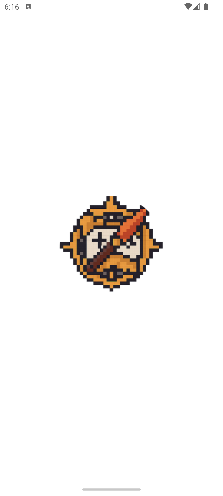 |   |
|  | 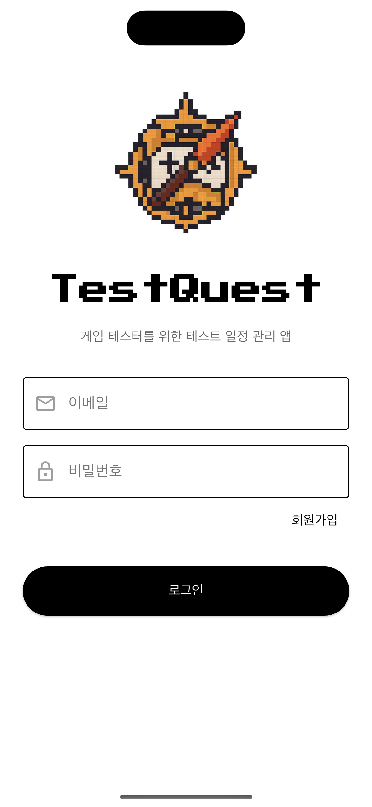 |
| 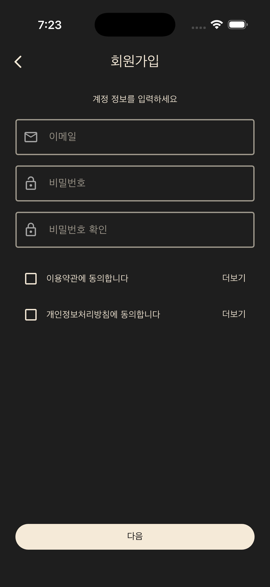 |  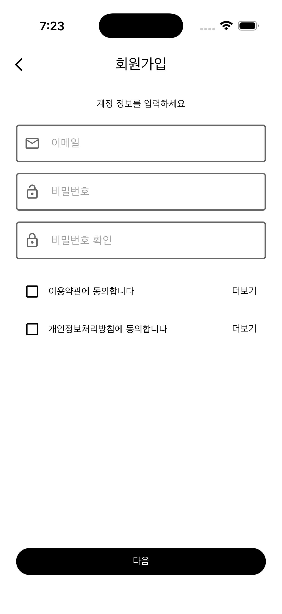|
| 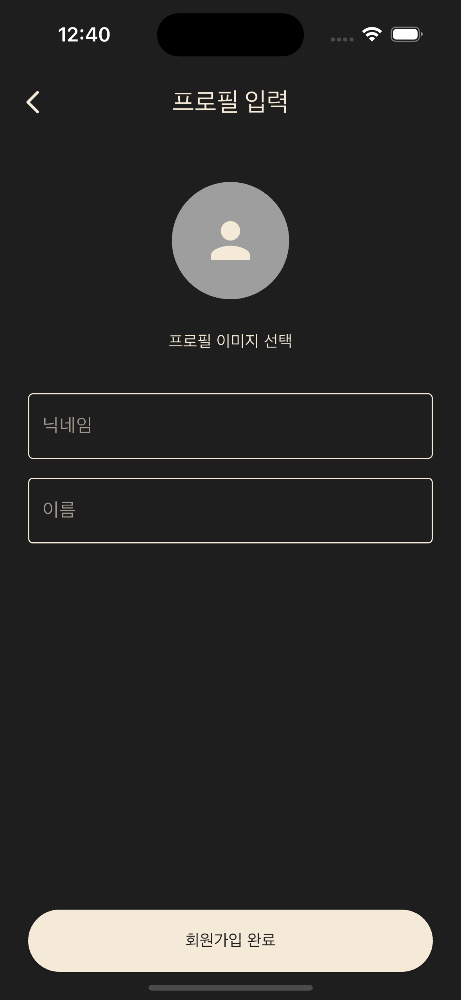 |  |
| 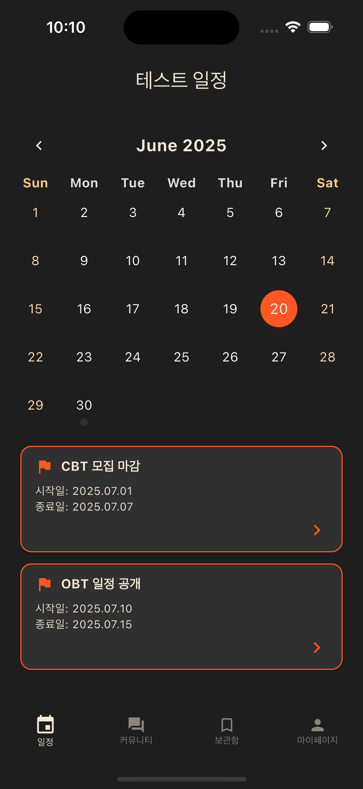 | 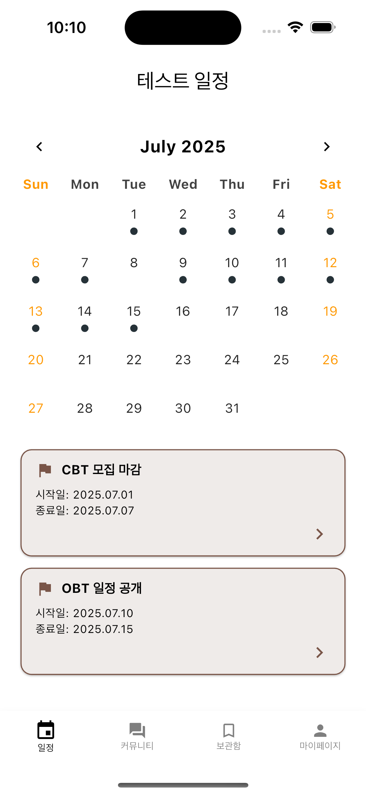 |
|  |  |
|  |  |
| 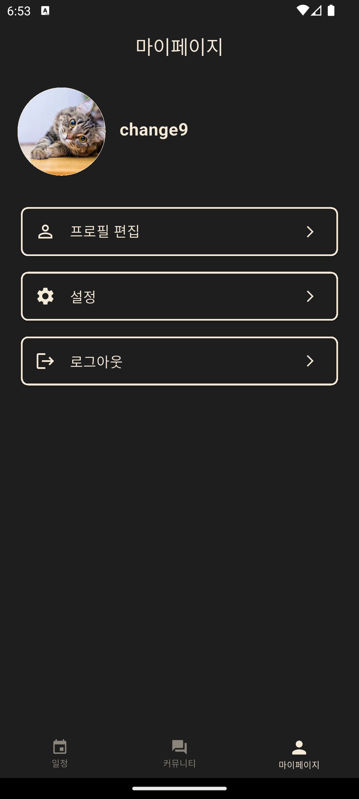 | 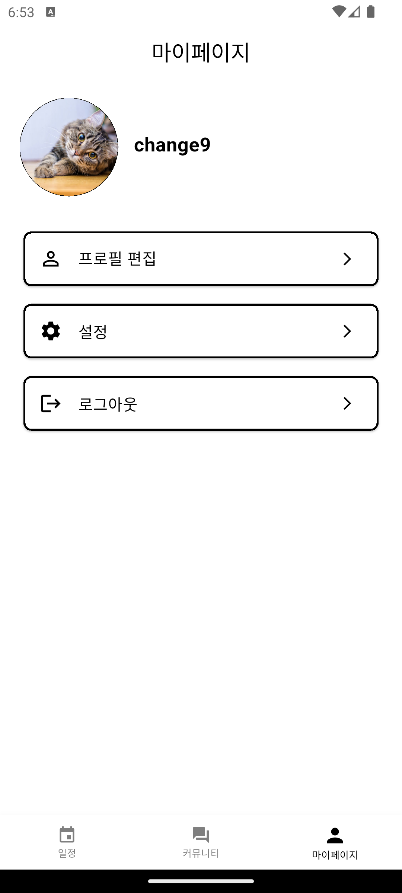 |
| 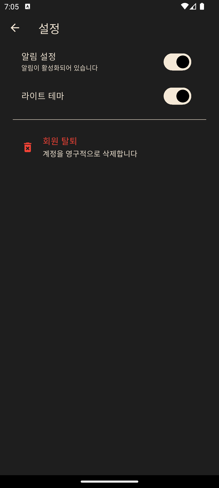 |  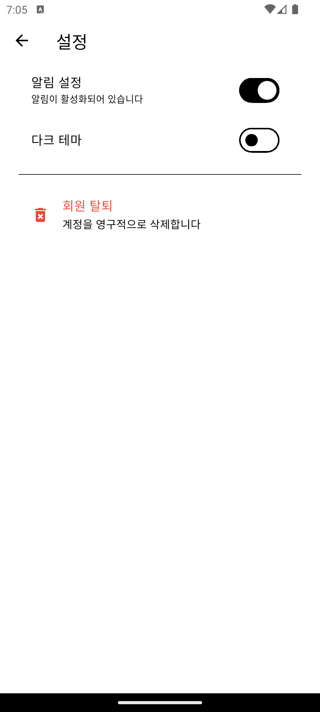 |


## 🚀 주요 기능

- 📅 게임 테스트 일정 모아보기 (개발 중)
- 🔍 CBT/OBT 정보 검색 및 필터링 (추후 에정)
- 🗣 유저 간 커뮤니티 (추후 예정)
- 🧭 알림 및 푸시 기능 (개발 중)

---

## 🛠 사용 기술

| 기술         | 설명                             |
|--------------|----------------------------------|
| Flutter 3.0+ | 크로스 플랫폼 UI 프레임워크            |
| Dart 3.0+    | 타입 안정성과 성능이 강화된 언어         |
| Riverpod 2.x | 상태 관리                          |
| Drift        | 로컬 DB                           |
| Freezed      | 불변 데이터 모델,                    |
| Dio          | HTTP 통신                         |
| json_serializable | JSON 직렬화 자동화             |
---

## 📦 프로젝트 구조

```
lib
 ├── common          # 공통 위젯, 설정
 ├── community       # 게시판 글 관련 화면 및 로직
 ├── mypage          # 사용자 프로필 관련 화면 및 로직
 ├── schedule        # 테스트 일정 관련 화면 및 로직
 ├── settings        # 설정 화면 및 로직
 ├── theme           # 테마 및 컬러
 ├── user            # 로그인/회원가입
 ├── util            # dio 및 알림, 권한 service모음 
 └── main.dart           # 앱 진입점
```

---


## 👨‍💻 개발자

APP - 최준현  
BackEnd - [강찬혁](https://github.com/ChanHyeokKang99)
